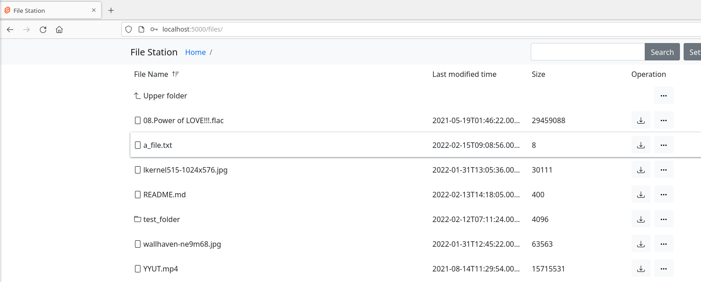
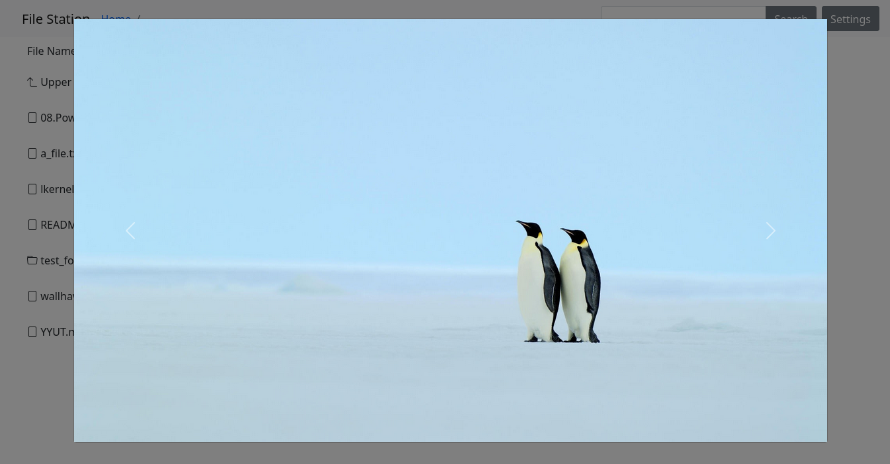
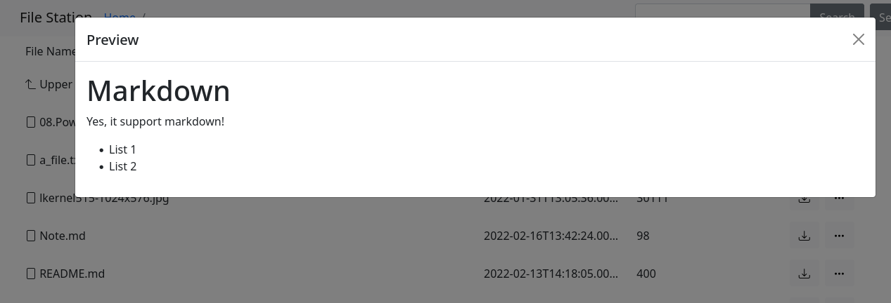
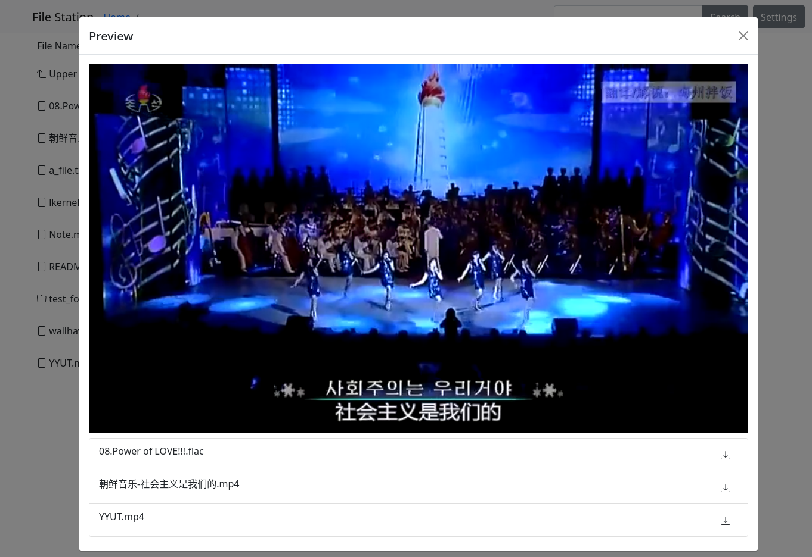

# file-station

Just a single file net disk for single person.

## Features

- Don't need nginx, apache, just download single binary file and run
- Authentication
- Upload, download, delete, rename, move and search files
- Share files
- Preview audio/video/image/markdown

## Screenshot

<details>
    <summary>Click to show</summary>
    
    
    
    
</details>

## Quick start

### Download 

You can get prebuild binary file from [HERE](https://github.com/chenx6/file-station/releases)

### Add some options

Add environment variable below to customize configs.

| Name | Default | Explain |
| - | - | - |
|FS_FOLDER|./files|File folder, store all files in here|
|FS_DATABASE|./database.db|Database position|
|FS_LISTEN|127.0.0.1:5000|Listen host and port|
|FS_REGISTER|TRUE|Can register or not ("TRUE" or "FALSE")|
|FS_SALT|...|Used for password hash(see [Salt's document](https://docs.rs/password-hash/*/password_hash/struct.Salt.html))|

### Run

```bash
chmod +x ./file-station
./file-station
```

### Run as a service

See [deploy](./deploy/) folder for example.

## Static Build

```bash
rustup target add x86_64-unknown-linux-musl  # Add rust musl toolchain
apt install musl-tools  # Install musl-gcc
cargo build --release --target=x86_64-unknown-linux-musl
```

## Alternatives

- [h5ai](https://larsjung.de/h5ai/)
- [zhaojun1998/zfile](https://github.com/zhaojun1998/zfile)
- [files.gallery](https://www.files.gallery/)
- [XnSger/EvoDire](https://github.com/XnSger/EvoDire)
